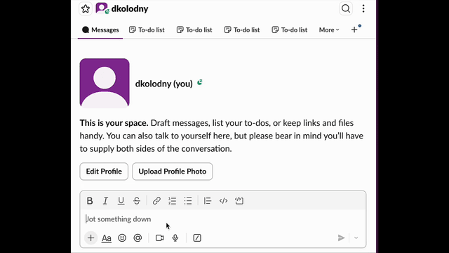

# ✨ SpellCheck Buddy (A simple one-keystroke spell-checking helper powered by **AWS Nova**.)

Highlight any text → press your shortcut → get back a corrected version instantly.  
No popup windows, no switching apps — it fixes your writing in place.

---

## 🔥 What this workflow does
- Grabs currently selected text in macOS
- Sends it to **AWS Nova LLM**
- Returns corrected grammar + spelling
- Automatically pastes the fixed text back where it was

A friction-free writing assistant right inside your keyboard.

---

## 🛠 Requirements
| Dependency | Needed for |
|-----------|------------|
| **Alfred 5** (Powerpack) | To run workflows + hotkey triggers |
| **AWS CLI / Nova credentials** | To send text for correction |
| macOS 12+ | Tested + working |

---

## 📥 Installation
1. Download the file  
   **`spell.alfredworkflow`**
2. Double-click to install in Alfred
3. Assign your own Hotkey inside the workflow (⌥ + ⇧ + S recommended)

⚠️ *Note: Alfred will remove hotkeys/snippets upon import for safety — you must set your own.*

---

## 🚀 Usage
1. Highlight any text anywhere (Mail, Notion, VSCode, Safari…)
2. Hit your assigned workflow shortcut
3. Text is magically corrected in place ✨

---

## 🔧 Configuration
Inside the workflow you may edit:
- Prompt instructions (tone, strictness, output format)
- Keybinding
- Nova model or temperature settings
- Replace vs display output (coming soon)

---

## 🏗 How it works (Technical Overview)
This workflow:
1. Captures selected text using Alfred
2. Pipes content into a script that calls **Nova API**
3. Receives corrected output
4. Pastes it back using macOS programmatic paste

---

## 🧭 Roadmap
- ⬜ Add context-aware rewriting
- ⬜ Add translation mode
- ⬜ Replace text vs inline suggestions
- ⬜ Batch-correct files

PRs & ideas welcome.

---

## 🤝 Contribute / Feedback
Open an issue or just message me — I’d love to hear improvement ideas.

---
